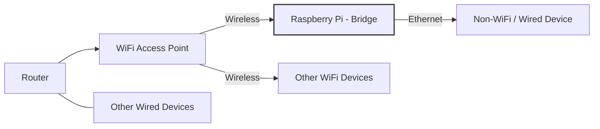

# WiFi-to-Ethernet Bridge




This project aims to create a transparent WiFi-to-Ethernet bridge for your home network. With this setup, you can easily connect devices (?) that lack WiFi support to your network without running cables everywhere or relying on technologies like D-LAN.

**Note:** Raspberry Pi uses NetworkManager instead of wpa-supplicant, so the [standard Debian instructions](https://wiki.debian.org/BridgeNetworkConnectionsProxyArp) must be adapted.

### Required Packages

Install the following packages:
```
sudo apt-get install parprouted dhcp-helper avahi-daemon
```

### System Configuration

Enable IP forwarding by adding the following to `/etc/sysctl.d/local.conf`:
```
net.ipv4.ip_forward=1
```

Configure DHCP relay in `/etc/default/dhcp-helper`:
```
DHCPHELPER_OPTS="-b wlan0 -i eth0"
```

Enable mDNS relaying by editing `/etc/avahi/avahi-daemon.conf`.

### NetworkManager Dispatcher Scripts

Referencing [this AskUbuntu post](https://askubuntu.com/questions/1111652/network-manager-script-when-interface-up), create `post-up.sh` and `post-down.sh` scripts in `/etc/NetworkManager/dispatcher.d/`.

Make sure both scripts are executable and owned by root:
```
chmod +x post-up.sh post-down.sh
chown root post-up.sh post-down.sh
```

### Disabling Wired Connection Autoconnect

NetworkManager may attempt to connect via `eth0`, which interferes with the ARP bridge. Disabling the netplan configuration for `eth0` (e.g., setting `activation-mode: off` in the YAML) may not work. Disabling autoconnect via NetworkManager is more reliable.

Check autoconnect status:
```
nmcli -f name,autoconnect con show
```
If "Wired connection 1" (assigned to `eth0`) is still set to autoconnect, disable it:
```
sudo nmcli c modify "Wired connection 1" connection.autoconnect no
```
Restart the system to apply changes.

### References

- [Debian ARP Bridge Example](https://wiki.debian.org/BridgeNetworkConnectionsProxyArp)
- [AskUbuntu: NetworkManager Dispatcher Scripts](https://askubuntu.com/questions/1111652/network-manager-script-when-interface-up)
- [AskUbuntu: Disabling Network Interface](https://askubuntu.com/questions/1445221/permanently-disable-network-interface-in-ubuntu-22-04)
